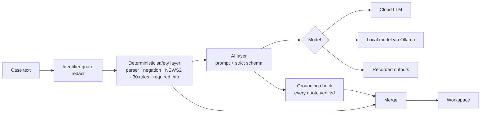

# Sanad (سند)

**Clinical decision support where every suggestion traces back to the case.**

Sanad is a web prototype for a fictional outpatient clinic. A clinician writes a short, de-identified case and Sanad returns a structured case summary, the important information still missing, a next-step checklist for clinician review, and urgent red-flag warnings. It is a decision-support prototype, **not** a diagnostic device, and it is for fictional cases only.

*Sanad* is Arabic for "support"; in classical scholarship it is also the chain of sources behind a claim. That is the design idea: deterministic safety checks first, AI second, and every statement linked to the words in the clinician's text.

- Live demo: _add the Vercel URL_
- Demo video: _add the link_

> Screenshot: _add after the first live run._

## What it does

| Requested output | How Sanad produces it |
|---|---|
| Structured case summary | The AI organises only stated facts into clinical sections; each fact carries a verbatim quote that code verifies against the case text. |
| Important missing information | A deterministic baseline (age/sex, allergies, medications, missing observations, pregnancy status, glucose) plus case-specific AI questions, with optional Arabic wording for patients. |
| Next-step checklist for clinician review | AI suggestions grouped by urgency, phrased as decision support, linked to the red flags they answer; the clinician ticks items as reviewed and can copy a note. |
| Urgent red-flag warnings | 30 deterministic rules and NEWS2 run first and cannot be removed by the model; the AI may add flags only with verified quotes. |

## Requirements traceability

| ID | Requirement (from the brief) | Where | How it is verified |
|---|---|---|---|
| R1 | Small web app for a fictional outpatient clinic | Next.js app, single workspace page | Build, browser checks |
| R2 | Clinician enters a short, de-identified scenario | Case panel; identifier guard removes names, phones, IDs, dates and addresses before analysis | `phi.test.ts` (positives and must-not-trigger cases) |
| R3 | Structured case summary | AI layer with a strict schema; grounding check on every quote | `ai.test.ts`, `pipeline.test.ts`, quote-verification rate in the evaluation |
| R4 | Important missing information | Rule baseline (`required-info.ts`) + AI questions, deduplicated | `required-info.test.ts`, `pipeline.test.ts` |
| R5 | Next-step checklist for clinician review | AI next steps by urgency, review ticks, copy as note | Coherence metric (rule flags answered by a step) |
| R6 | Urgent red-flag warnings | 30 rules + NEWS2 (`src/lib/safety`), merged with grounded AI flags | 394 safety tests including a 16-case golden set |
| R7 | Decision support, not autonomous diagnosis | Prompt rules, no differential-diagnosis list, no doses, disclaimers, clinician review | Prompt tests, interface copy, [`docs/SAFETY.md`](docs/SAFETY.md) |
| R8 | Fictional or synthetic cases only | Synthetic case library, banner, identifier guard | Case schema validation |
| R9 | LLM API, local model, rules, or hybrid | Hybrid: cloud (free Gemini or Groq tiers by default, also Anthropic, OpenAI, AI Gateway), local (Ollama) and recorded-output modes | `ai.test.ts` model-resolution tests |
| R10 | Support clinical thinking; improve organisation and safety | Annotated case text, NEWS2 observation chart, documentation completeness, transparency panel | Evaluation report |

## How it works



1. **Safety never depends on the AI.** Rules and NEWS2 run on every request (also live in the browser while typing) and render first. The model cannot remove or downgrade a rule flag.
2. **Grounded output.** Every summary fact and AI red flag carries a verbatim quote that code checks against the text. Unverified facts are marked; AI flags without a verified quote are dropped.
3. **Decision-support language.** "Consider…", "Evaluate for…". No diagnoses as fact, no medication doses.
4. **Privacy by design.** Identifiers are removed before any model call; nothing is stored; the server logs metadata only, never case text.
5. **Transparent.** Each result shows the model, prompt and rules versions, the rules that fired with their guidance basis, timings, quote checks and redactions.
6. **Graceful degradation.** If the AI fails, the full rule-based findings still return with a clear message.
7. **Model-agnostic and free to run.** The default cloud model is the free Gemini tier; Groq's free tier offers open-weight models; Ollama runs locally; recorded outputs need no key at all.

## Safety design

| Layer | What it does |
|---|---|
| Identifier guard | Detects names, phone numbers (Saudi and international), National ID / Iqama numbers, record numbers, full dates and addresses; live warning and one-click removal; always applied on the server. |
| Deterministic rules + NEWS2 | Parser for demographics and vital signs with unit conversion; concept lexicon with NegEx-style negation and family-history detection; 30 red-flag rules informed by NICE, RCP, BTS, Resuscitation Council UK, ADA and JBDS guidance; NEWS2 with partial-score lower bounds and applicability rules. |
| Constrained AI | Versioned system prompt that treats the case as data, strict JSON schema, one schema-repair retry, timeout. |
| Grounding check | Normalised verbatim matching of every quote, mapped back to exact positions in the text. |
| Clinician in the loop | Annotated case text, evidence that highlights the source words, "AI suggestion" labels with dashed outlines, review ticks. |
| Degradation | Typed AI errors (timeout, schema, provider, rate limit) never hide the rule findings. |

See [`docs/SAFETY.md`](docs/SAFETY.md) for the model and safety card and [`docs/SPEC.md`](docs/SPEC.md) for the full specification, including every rule and its threshold.

## Evaluation

Full report: [`docs/EVALUATION.md`](docs/EVALUATION.md), generated by `npm run eval` or the `/lab` page.

Current results, rule layer only (no model calls):

| Set | Rule sensitivity | Rule false positives | Benign cases with no flags | NEWS2 agreement |
|---|---|---|---|---|
| Development (16 cases) | 21/21 | 0 | 2/2 | 16/16 |
| Held-out | pending | pending | pending | pending |

The development set was used to build the rules, so 100% there is expected and is **not** a measure of generalisation. The held-out set is written after the rules were frozen, by a different author, and never used for tuning; its misses are reported, not fixed silently. AI metrics (schema validity, quote verification, coherence, latency) are added after the first live run.

## Run it

Requirements: Node.js 20.9 or later.

```bash
npm install
cp .env.example .env.local   # then add a free key (see below)
npm run dev                  # http://localhost:3000
```

**Free model.** Create a Gemini API key in [Google AI Studio](https://aistudio.google.com) (no credit card) and set `GOOGLE_GENERATIVE_AI_API_KEY`. The default model is `gemini-3.8-flash`. On the free tier Google may use prompts to improve its products, which is acceptable here only because every case is fictional. Alternatively set `GROQ_API_KEY` from [Groq](https://console.groq.com) for the open-weight `openai/gpt-oss-120b`.

| Mode | How | Use |
|---|---|---|
| Cloud | A provider key in `.env.local` (`LLM_PROVIDER` google, groq, anthropic, openai or gateway; optional `LLM_MODEL`) | Live AI |
| Local | `SANAD_MODE=local`, `LLM_MODEL=<an installed Ollama model>`, optional `OLLAMA_BASE_URL` | Data never leaves the machine |
| Demo | No key, or the "Use recorded AI outputs" switch | Zero-setup demo; rule checks stay live |

Other commands:

```bash
npm run check                 # typecheck + lint + 450 tests
npm run build                 # production build
npm run eval -- --rules-only  # rule-layer evaluation, writes docs/EVALUATION.md
npm run eval -- --delay 4000  # full evaluation with the configured model (pause for free tiers)
npm run record:demo -- --delay 4000  # record real model outputs for the sample cases
```

No terminal? Deploy with `SANAD_LAB=true` and a `SANAD_LAB_KEY`, open `/lab`, run all cases in the browser, and download `EVALUATION.md` and `recordings.json`. See [`docs/DEPLOY.md`](docs/DEPLOY.md).

## Deliberate scope decisions

- **No differential-diagnosis list.** It would frame the tool as diagnostic; clinical reasoning appears inside next-step rationales ("to evaluate for…").
- **Red flags first.** Time-critical information appears before the summary, even though the brief lists the summary first.
- **English interface.** The organisers work in English; Arabic wording is offered for patient-facing questions.
- **NEWS2 for adults only, scale 1 only.** Children and pregnancy get explicit "not applicable" messages instead of a misleading score.

## Limitations

- Rule thresholds are informed by published guidance but **not clinically validated**.
- The lexicon and negation handling cover common phrasings, not all of them; the rule layer reads English only (Arabic input is analysed by the AI layer and flagged).
- NEWS2 uses SpO2 scale 1; scale 2 (hypercapnic respiratory failure) is noted but not implemented. No paediatric vital-sign norms.
- Identifier detection is pattern-based and reduces risk; it does not guarantee de-identification.
- The language model can still be wrong; quotes are verified, interpretations are not.

## Built with

Next.js 16, React 19, TypeScript (strict), Tailwind CSS 4, Vercel AI SDK 7, Zod 4, Vitest, Radix Tooltip, Atkinson Hyperlegible Next (chosen for legibility) and IBM Plex Sans Arabic.

## Disclaimer

Prototype for a technical selection challenge. Fictional data only. Not a medical device and not for clinical use. Clinical deployment would require clinical validation and regulatory review (for example by the Saudi Food and Drug Authority) and compliance with the Personal Data Protection Law.
